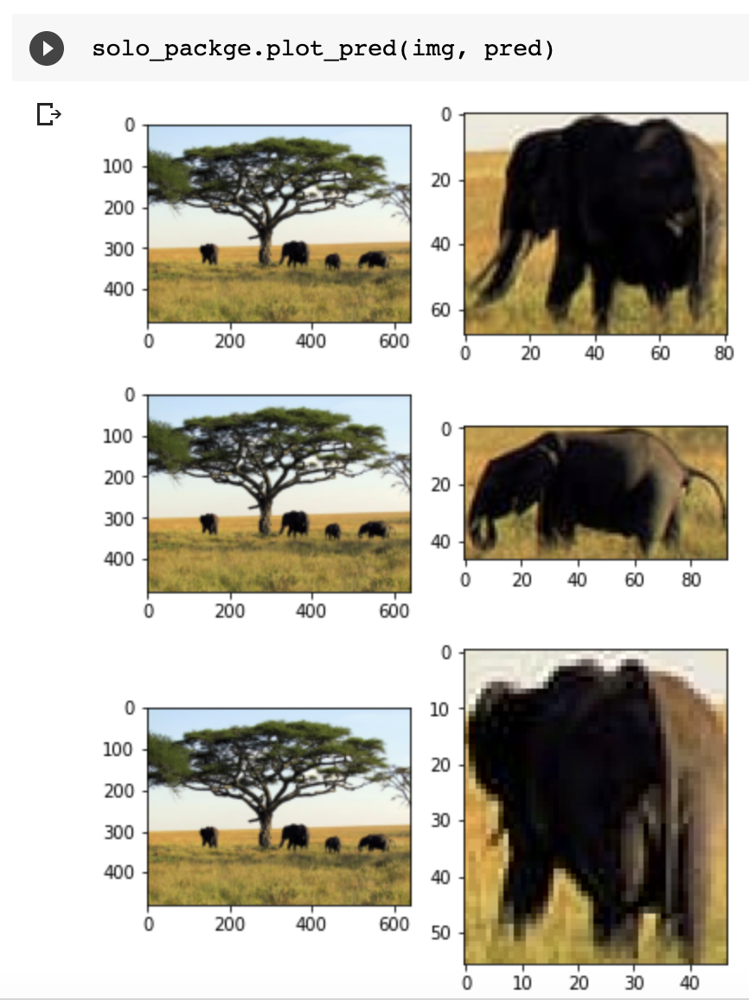

# ScaledYolo inference

[ScaledYOLOv4](https://github.com/WongKinYiu/ScaledYOLOv4) 👉 inference code for detecting yout images using ScaledYolov4


1. install mish-cuda
2. Dowload the repo
3. ``` import syolo ``` 


install mish-cuda
```

# install mish-cuda, if you use different pytorch version, you could try https://github.com/thomasbrandon/mish-cuda
cd /
git clone https://github.com/JunnYu/mish-cuda
cd mish-cuda
python setup.py build install

```


Download pre-trained weights from here or use your custom model from [here](https://github.com/WongKinYiu/ScaledYOLOv4) 


```

# Load your weights 
weights = 'weights/yolov4-p5.pt'
device = 'cpu' # you can change it to 0,1..etc for GPU
model,device = solo_packge.load_model(weights,device)

```


to return the original image with boxes:


```
import syolo
import cv2
image = 'test/test.jpeg'
image = cv2.imread(image)
output = 'output'

pred , img = syolo.detect(model,
           output,
           immg=image,
           img_size=416,
           device=device,
           conf_thres=0.7,
           iou_thres=0.5,
           classes=None,
           agnostic_nms=True,
          augment=True)

```


to plot the cropped images
```

syolo.plot_pred(img, pred)

```




to crop images:

```

croped_imgs = solo_packge.crop_pred(img, pred)

```
return result:

```

# [array([[[238, 234, 222],
#          [238, 234, 222],
#          [238, 234, 222],
#          ...,
#          [241, 235, 223],
#          [241, 235, 223],
#          [241, 235, 223]],
 
#         [[238, 234, 222],
#          [238, 234, 222],
#          [238, 234, 222],
#          ...,
#          [241, 235, 223],
#          [241, 235, 223],
#          [241, 235, 223]],
 
#         [[238, 234, 222],
#          [238, 234, 222],
#          [238, 234, 222],
#          ...,
#          [241, 235, 223],
#          [241, 235, 223],
#          [241, 235, 223]],
 
#         ...,

``` 


